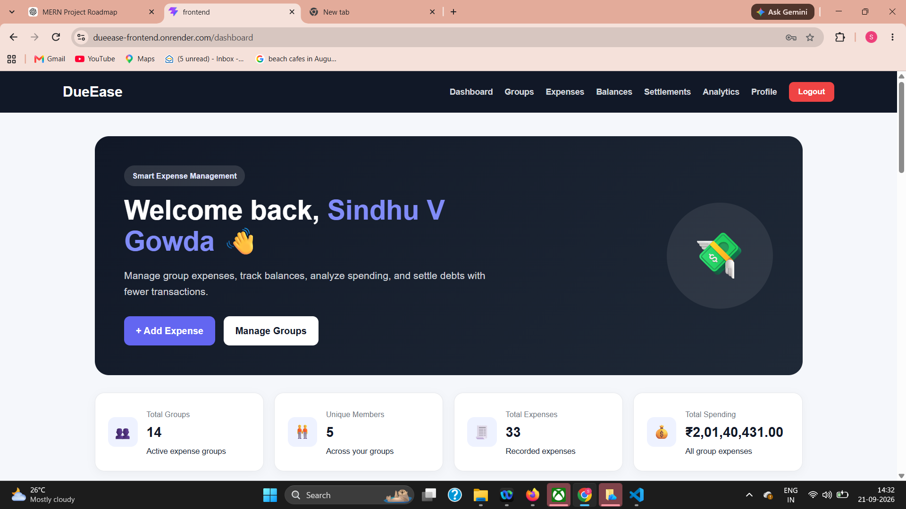
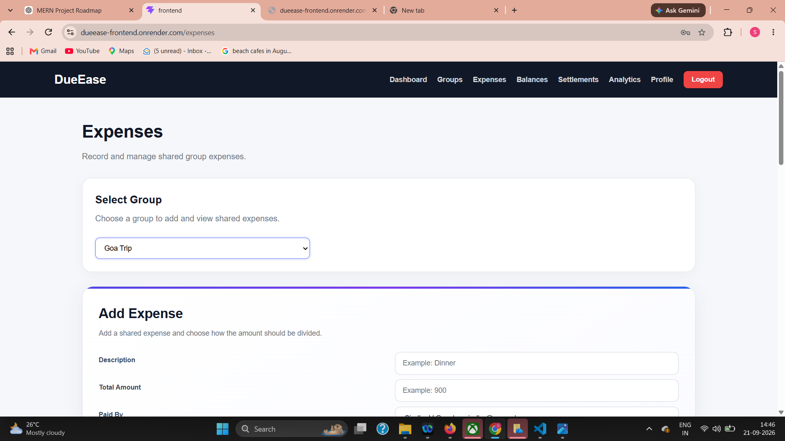

\# DueEase 💰


A full-stack expense management application that helps groups track shared expenses, calculate balances, and simplify settlements.


\## 🚀 Live Demo


\*\*Frontend:\*\* https://dueease-frontend.onrender.com


\*\*Backend:\*\* https://dueease-backend.onrender.com


\## ✨ Features


\- User registration and login

\- JWT-based authentication

\- Create and manage groups

\- Add group members

\- Create shared expenses

\- Equal, exact, and percentage-based splitting

\- Automatic balance calculation

\- Debt simplification for minimum settlement transactions

\- Settlement management

\- Real-time updates using Socket.IO

\- Expense search and filtering

\- Expense pagination

\- Analytics dashboard

\- Spending summaries

\- UPI payment QR generation

\- User profile and UPI ID management

\- Responsive mobile-friendly interface

\- Production deployment


\## 🛠️ Tech Stack


\### Frontend

\- React

\- Vite

\- React Router

\- Axios

\- Socket.IO Client

\- React Hot Toast

\- Recharts

\- QRCode React


\### Backend

\- Node.js

\- Express.js

\- MongoDB

\- Mongoose

\- JWT

\- bcryptjs

\- Socket.IO


\### Deployment

\- Render

\- MongoDB Atlas


\## 🧠 Debt Simplification


DueEase calculates each member's net balance and simplifies the debts so that the group can settle using fewer transactions.


For example:


Instead of:


\- A pays B

\- B pays C

\- C pays A


the application calculates the net amounts and produces a simplified settlement plan.


\## 📂 Project Structure


```text

DueEase/

├── middleware/

├── models/

├── routes/

├── utils/

├── frontend/

│   └── src/

├── server.js

├── package.json

├── package-lock.json

├── .gitignore

└── README.md

## 📸 Screenshots

### Dashboard
## 📸 Screenshots

### Dashboard



### Expenses




